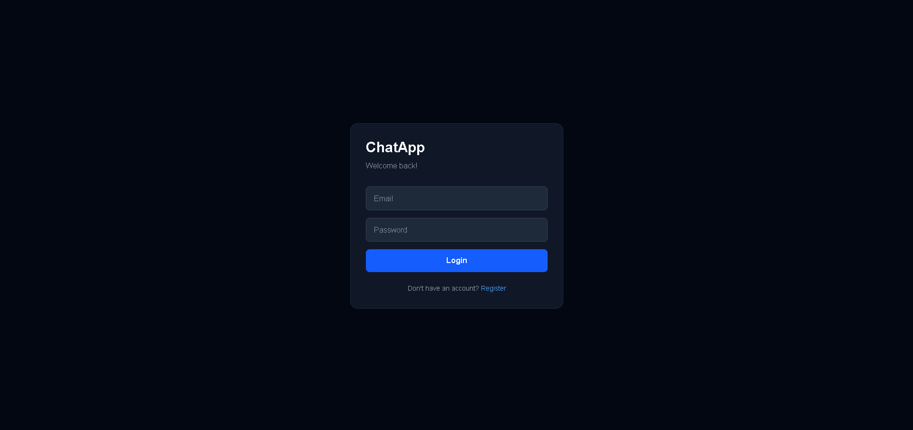
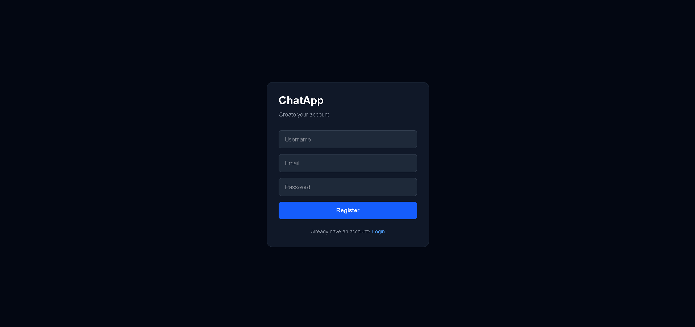
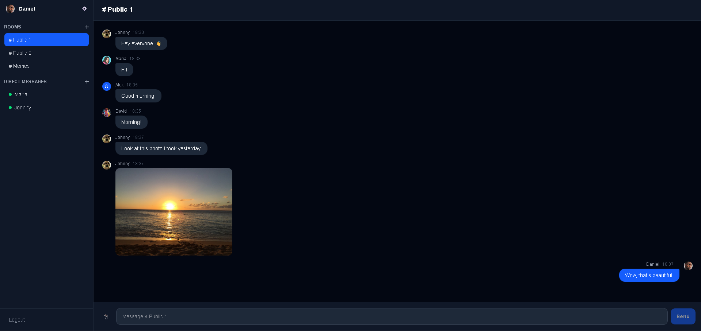
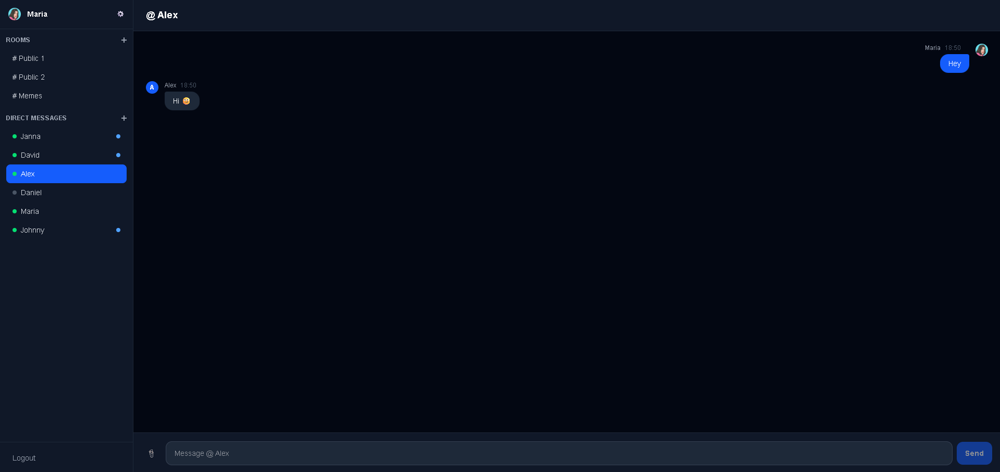
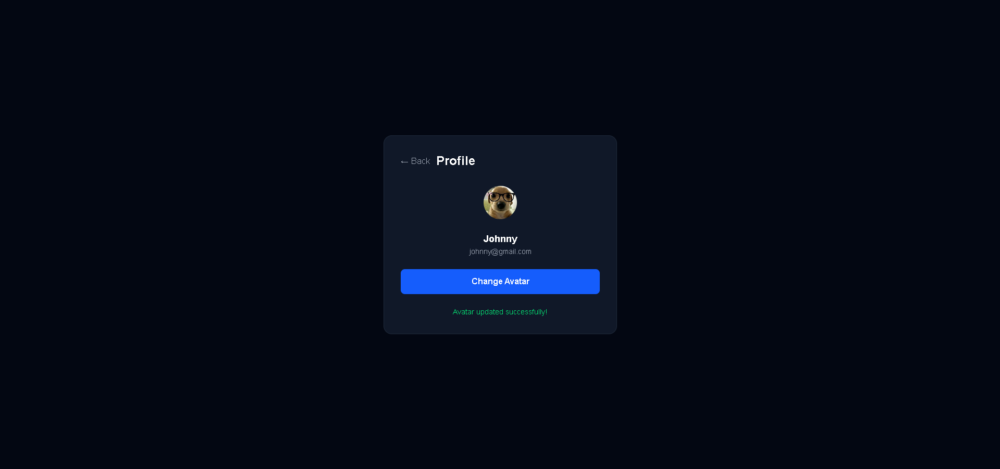

# ChatApp — Real-Time Chat Application

A full-stack real-time chat application built with modern technologies, featuring public rooms, direct messages, image sharing, and live presence indicators.

## 📸 Screenshots







## 🛠️ Tech Stack

**Frontend:**
- Next.js 15 + React
- TypeScript
- Tailwind CSS
- Axios
- SignalR Client (`@microsoft/signalr`)

**Backend:**
- ASP.NET Core Web API (.NET 10)
- Entity Framework Core
- PostgreSQL
- JWT Authentication
- BCrypt password hashing
- SignalR (real-time communication)

## ✨ Features

- User authentication (register and login with JWT)
- Avatar / profile picture upload
- Create, join and delete public chat rooms
- Real-time messaging in rooms via SignalR
- Direct messages between users
- Image sharing (upload or paste from clipboard)
- Delete messages
- Typing indicator
- Online / offline presence indicators
- Unread message badges
- Fully responsive UI

## 📦 Getting Started

### Prerequisites

- .NET 10 SDK
- Node.js 18+
- PostgreSQL

### Backend Setup

```bash
cd ChatApp.API
```

Create your `appsettings.json` file:

```json
{
  "ConnectionStrings": {
    "DefaultConnection": "Host=localhost;Port=5432;Database=chatapp;Username=postgres;Password=yourpassword"
  },
  "JwtSettings": {
    "SecretKey": "your-secret-key-minimum-32-characters-long",
    "Issuer": "ChatAppAPI",
    "Audience": "ChatAppClient",
    "ExpirationHours": 24
  },
  "Logging": {
    "LogLevel": {
      "Default": "Information",
      "Microsoft.AspNetCore": "Warning"
    }
  },
  "AllowedHosts": "*"
}
```

Run migrations and start the API:

```bash
dotnet ef database update
dotnet run
```

API will be available at `http://localhost:5216`  
Scalar API docs at `http://localhost:5216/scalar`

### Frontend Setup

```bash
cd chatapp-web
```

Create a `.env.local` file:

```
NEXT_PUBLIC_API_URL=http://localhost:5216
```

Install dependencies and run:

```bash
npm install
npm run dev
```

Frontend will be available at `http://localhost:3000`

## 📁 Project Structure

```
ChatApp/
├── ChatApp.API/                  # .NET Backend
│   ├── Controllers/              # API endpoints
│   ├── Models/                   # Database entities
│   ├── DTOs/                     # Data transfer objects
│   ├── Services/                 # Business logic
│   ├── Hubs/                     # SignalR hub
│   ├── Data/                     # DbContext
│   └── wwwroot/uploads/          # Uploaded files
│
└── chatapp-web/                  # Next.js Frontend
    ├── app/                      # Pages
    ├── components/               # Reusable components
    ├── context/                  # Auth context
    ├── hooks/                    # useChat (SignalR)
    ├── lib/                      # Axios configuration
    └── types/                    # TypeScript types
```

## 📄 API Endpoints

| Method | Endpoint | Description | Auth |
|--------|----------|-------------|------|
| POST | /api/auth/register | Register user | ❌ |
| POST | /api/auth/login | Login user | ❌ |
| GET | /api/users | List users | ✅ |
| POST | /api/users/avatar | Upload avatar | ✅ |
| GET | /api/rooms | List rooms | ✅ |
| POST | /api/rooms | Create room | ✅ |
| DELETE | /api/rooms/{id} | Delete room | ✅ |
| POST | /api/rooms/{id}/join | Join room | ✅ |
| POST | /api/rooms/{id}/leave | Leave room | ✅ |
| GET | /api/messages/room/{id} | List room messages | ✅ |
| GET | /api/messages/conversation/{id} | List DM messages | ✅ |
| POST | /api/messages | Send message | ✅ |
| DELETE | /api/messages/{id} | Delete message | ✅ |
| POST | /api/messages/upload | Upload image | ✅ |
| GET | /api/conversations | List conversations | ✅ |
| POST | /api/conversations/{userId} | Start DM | ✅ |

## ⚡ SignalR Events

| Event | Direction | Description |
|-------|-----------|-------------|
| `OnlineUsers` | Server → Client | Initial list of online users |
| `UserOnline` | Server → Client | User came online |
| `UserOffline` | Server → Client | User went offline |
| `ReceiveRoomMessage` | Server → Client | New message in room |
| `ReceiveDirectMessage` | Server → Client | New direct message |
| `MessageDeleted` | Server → Client | Message was deleted |
| `RoomCreated` | Server → Client | New room created |
| `RoomDeleted` | Server → Client | Room was deleted |
| `ConversationUpdated` | Server → Client | New DM conversation started |
| `UserTypingInRoom` | Server → Client | User is typing in room |
| `UserTypingInDirect` | Server → Client | User is typing in DM |

## 👨‍💻 Author

Made by [otavioleme](https://github.com/otavioleme)
